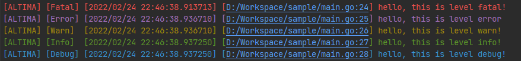

### About

一款能够应付日常开发的简单异步日志库。

### Feature

- [x] 格式化日志输出
- [x] 日志缓冲区大小可配置
- [x] 异步执行日志文件切割
- [x] 日志缓冲区flush周期可配置
- [x] 异步记录日志(终端采用同步输出)
- [x] `temp.log`总是当前正在输出的日志文件 
- [x] 日志输出级别可配置(默认不输出任何级别的日志)
- [x] 配置项可选, 可根据自己的需求选择不同Option进行初始化
- [x] 日志级别划分: Fatal(致命错误), Error(错误), Warn(警告), Info(流水), Debug(调试信息)
- [x] 在控制台使用颜色对不同级别的日志进行区分: Fatal(红色), Error(紫红色), Warn(黄色), Info(绿色), Debug(蓝色)
- [x] 提供多种日志文件切割周期: CutDaily(24小时), CutHourly(每小时), CutHalfAnHour(每半小时), CutTenMin(每10分钟), CutPer10M(每10M), CutPer60M(每60M), CutPer100M(每100M)
- [x] 提供不同的日志记录方式: WriteByLevel(区分级别记录在不同的文件), WriteByMerged(所有日志记录在一起), WriteByAll(既区分级别同时也记录在同一个文件)

### Usage

```go
package main

import (
	"time"

	"github.com/pyihe/plogs"
)

func main() {
    opts := []plogs.Option{
        plogs.WithCutOption(plogs.CutTenMin),
        plogs.WithAppName("ALTIMA"),
        plogs.WithBufferSize(1024),
        plogs.WithFlushDuration(500 * time.Millisecond),
        plogs.WithWriteOption(plogs.WriteByMerged),
        plogs.WithLogPath("./files"),
        plogs.WithWriteLevel(plogs.LevelFatal | plogs.LevelError | plogs.LevelWarning | plogs.LevelInfo | plogs.LevelDebug),
        plogs.WithStdout(true),
    }
    
    logger := plogs.NewLogger(opts...)
    defer logger.Close()
    
    plogs.Fatalf("hello, this is level fatal!")
    plogs.Errorf("hello, this is level error")
    plogs.Warnf("hello, this is level warn!")
    plogs.Infof("hello, this is level info!")
    plogs.Debugf("hello, this is level debug!")
}

```


### TODO

- [ ] 提供日志文件保存最多个数限制以及保存最长时间限制
- [ ] 优化文件及代码行号: 不显示系统绝对路径，只显示文件及代码在项目中的相对路径

### Thanks 

感谢[Jetbrains开源开发许可证](https://www.jetbrains.com/zh-cn/community/opensource/#support) 提供的免费开发工具支持!

