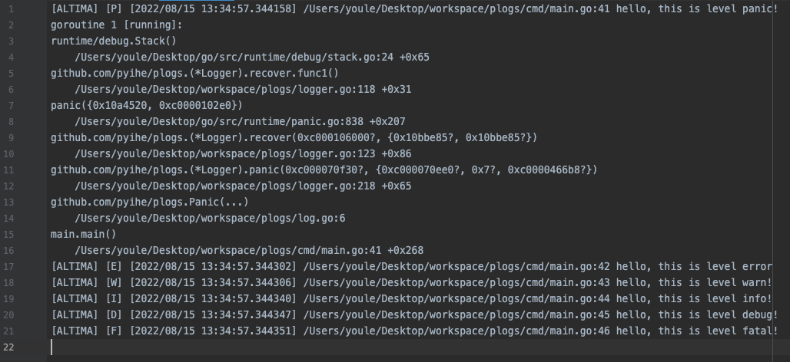

### Feature

- [x] 格式化日志输出
- [x] 异步执行日志文件切割
- [x] 异步记录日志(终端采用同步输出)
- [x] `temp.log`总是当前正在输出的日志文件 
- [x] 日志输出级别可配置(默认输出所有级别的日志)
- [x] 日志级别划分: Panic(异常, 可以捕获), Fatal(致命错误), Error(错误), Warn(警告), Info(流水), Debug(调试信息)
- [x] 提供不同的日志记录方式: `WriteByLevelSeparated(根据Level记录在不同的子目录下)`, `WriteByLevelMerged(所有Level的日志记录在一起)`, `WriteByBoth(单独记录与归并记录同时存在)`
- [x] 日志文件切割方式: 达到指定大小后执行切割, 默认不切割
- [x] 提供日志文件保存时长设置: 超过该时长的文件将被删除, 默认不作删除操作

### Usage

```go
package main

import (
	"time"

	"github.com/pyihe/plogs"
)

func main() {
    opts := []plogs.Option{
        plogs.WithName("ALTIMA"),
        plogs.WithFileOption(plogs.WriteByLevelMerged),
        plogs.WithLogPath("./files"),
        plogs.WithLogLevel(plogs.LevelFatal | plogs.LevelError | plogs.LevelWarn | plogs.LevelInfo | plogs.LevelDebug),
        plogs.WithStdout(true),
        plogs.WithMaxAge(24 * time.Hour),
        plogs.WithMaxSize(10 * 1024 * 1024),
    }
    
    logger := plogs.NewLogger(opts...)
    defer logger.Close()
    
    plogs.Errorf("hello, this is level error")
    plogs.Warnf("hello, this is level warn!")
    plogs.Infof("hello, this is level info!")
    plogs.Debugf("hello, this is level debug!")
    plogs.Fatalf("hello, this is level fatal!")
    plogs.Panic("hello, this is level panic!")
}

```

### Terminal Screenshot


### File Screenshot


### Thanks
感谢[Jetbrains开源开发许可证](https://www.jetbrains.com/zh-cn/community/opensource/#support) 提供的免费开发工具支持!

